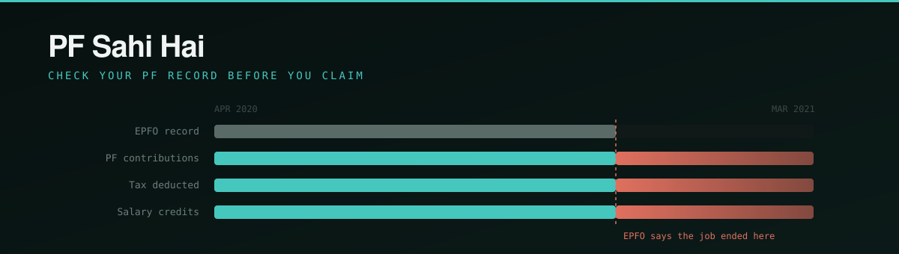

<div align="center">



# 🧾 PF Sahi Hai

**EPFO tells you your claim was rejected. It doesn't tell you why.** PF Sahi Hai
reads records you already own, finds the exact field that will freeze your claim,
and shows you what your record looks like once it's fixed — **before you file.**

Built for **[Build What Moves India](https://buildwhatmovesindia.com)** — a re-imagining of the
EPFO member portal, rebuilt inside their own information architecture so the new
parts could be adopted rather than bolted on.

<p>
  <a href="https://pf-sahi-hai-251148844884.asia-south1.run.app"></a>
  <a href="https://github.com/aniket-3001/pf-sahi-hai/actions/workflows/deploy.yml"></a>
  
</p>

<p>
  
  
  
  
  
  
</p>

[**Live demo**](https://pf-sahi-hai-251148844884.asia-south1.run.app) ·
[The problem](#the-problem) ·
[What it does](#what-it-does) ·
[How it works](#how-it-works) ·
[Guarantees](#four-guarantees-enforced-by-code) ·
[Quick start](#quick-start) ·
[Testing](#testing) ·
[Docs](Docs/)

<sub>🤖 Built with AI assistance (Claude / Claude Code) — see the <a href="#ai-assistance-disclosure">full disclosure</a>.</sub>

</div>

---

## Try it in thirty seconds

No documents needed. Two accounts, credentials printed on the sign-in page.

| UAN | Password | The record |
|---|---|---|
| `100999888777` | `rahul` | Three employers, a wrong exit date, a missing one, and an account he doesn't know exists |
| `100777666555` | `priya` | Everything agrees — proof a green answer means something, because it can be withheld |

Sign in as Rahul, then walk **Home → Service Timeline → Claim Check → Corrections
→ Joint Declaration → Preview the outcome.** That path is the whole product.

---

## The problem

Roughly **one in five EPF claims is rejected** — about **174 lakh of 796 lakh**
filed in 2024-25. EPFO cites a sub-1% figure; that counts office-level rejections
*after* auto-settlement, not claims filed. The official number and the member's
experience differ by more than twentyfold.

The failures concentrate in a handful of fields a member cannot correct alone:
**date of joining, date of exit, overlapping service.** Employers typed them, and
some of those employers no longer exist.

> A person's own savings are gated on the data hygiene of every employer they
> have ever had.

And you find out afterwards. EPFO's own claim tracker records the word
**"Rejected"** with no reason field at all — verified on a live member account.

### Why EPFO 3.0 doesn't close this

EPFO 3.0 raised auto-settlement to ₹5 lakh, removed employer approval for digital
withdrawals, and set a three-day settlement target.

**It automates the decision. It doesn't fix the data the decision is made on.**
Service continuity is an explicit automated validation gate — so a wrong date now
produces an instant rejection instead of a slow one, and removes the human you
could previously have appealed to.

---

## The insight

**Form 26AS, on the Income Tax portal, records TDS by employer, month by month,
with each employer's TAN.**

That is an independent, government-held, *citizen-accessible* record of exactly
when a person worked where. Your own tax record can prove the EPFO service record
wrong — and because **you download both yourself**, no inter-departmental
data-sharing agreement is required.

One detail that matters, and is easy to get backwards: **26AS is never submitted
to EPFO.** It isn't on their accepted-evidence list. When a member self-corrects a
date, EPFO validates it against *its own ECR contribution records* — so 26AS is
used to work out **which date will match**. It aims the correction; it doesn't
file it.

---

## What it does

Four capabilities the real portal has no equivalent for. Everything else on the
site is a faithful rebuild of a screen that already exists.

### 🗓️ Service Timeline · `app/solver.py → reconstruct()`

Four records drawn on one axis — EPFO's version, PF contributions, TDS months,
salary credits. Where EPFO's track stops short of the others, that overhang *is*
the defect.

The claim it makes is deliberately narrow: not *"you left on this date"* but
**"you were still employed on this date, so a recorded exit before it is wrong"** —
a fact, not an estimate, and one that survives an argument at a counter.
Confidence is `High / Medium / Low` by independent sources agreeing, **never a
percentage** — we cannot calibrate one, and a fabricated number is worse than none.

### ✅ Claim Check · `app/solver.py → gates()`

EPFO's published pre-settlement checks as an auditable decision procedure —
**14 named gates**, each with a code and the field that fails it.

Anything held privately inside EPFO reports **`Not visible`**, never `Pass`.
Gates also come in two kinds: most block a settlement, but an account EPFO never
linked is **advisory** — it costs the member money without stopping the claim, so
it is reported as *money left behind* rather than counted as a rejection.

### 🔧 Corrections · `app/solver.py → plan()`

Corrections have dependencies. Filing a transfer against an account whose exit
date is still open gets it rejected — **twenty days spent for nothing.** The
planner orders them and reports the critical path.

### 🔎 Why Was My Claim Rejected · `app/solver.py → diagnose()`

EPFO's tracker shows a status word and no reason. This replays the record *as it
stood on the filing date* and names what was already wrong. Deliberately
conservative: only defects whose supporting evidence **predates the filing date**
can be named.

### And the loop that closes it · `app/corrections.py`

Submit a correction and four checks run — is the date supported by the
contribution record, is it after the joining date, does it create an overlap, is
the document one EPFO accepts. **Those are the same things EPFO's own validation
tests**, which is why passing them means something.

Then **Preview the outcome**: the service history is rebuilt with the corrected
dates and every parser and the reconciler run again from the original documents.
On the demo record two blocking checks clear and the claim forms move from
`Blocked` to `Open` — recomputed, not a flag we set.

**Three rules hold throughout.** We never say a *document* is verified — we can't
read an appointment letter, so we check the **correction**. Nothing is submitted
anywhere; the furthest a correction goes is *ready to file*. And there is **no
rejected state** — a failing check returns the correction asking for one named
thing.

---

## How it works

```
 Form 26AS ─┐
 Passbook  ─┤                                        ┌─ Service Timeline
 History   ─┼─▶ ingest ─▶ parsers ─▶ reconciler ─────┼─ Claim Check
 Bank      ─┘   by         arithmetic   8 defect     ├─ Corrections
                content    backstop     classes      ├─ Why Rejected
                                        4 routes     └─ Correction loop
```

**Ingestion is by content, not by upload box.** Drop all four documents into one
field and you get the same answer — tested.

**Every extraction is checked before it's trusted.** Form 26AS transaction rows
must reconcile to the deductor summary to ₹1, or the extraction is rejected and
retried. *The parser proposes; the checker disposes.*

### The architectural line

> **Models at the edges, where language is messy.
> A deterministic solver at the core, where the answer must be auditable.**

The output is a document a member **signs and submits to a government office**. If
it is disputed, they must be able to say *"this inference is wrong, and here is
the step where it went wrong."* A model cannot be cross-examined. A weighted
constraint system can.

| Layer | May use a model | Why |
|---|---|---|
| Ingestion, normalisation, classification | **Yes** | Language variance, where rules are weak |
| Reconciliation, ranking, routing | **No** | Every step must be arguable |
| Generation | **Yes, behind a gate** | Prose is a language task; facts are not |

**In practice no model runs at all.** `OpenAIBackend` is a working extension point
that has never executed — the deployed service runs `OfflineBackend`, entirely on
local rules. That buys an *absolute* privacy claim rather than a qualified one:
not "isn't stored", but **doesn't leave the server**. What it costs is disclosed
on-screen — only Devanagari is transliterated, and scanned documents are refused
rather than guessed at.

### The eight defect classes

| Kind | Plain meaning |
|---|---|
| `MISSING_EXIT` | No exit date; EPFO reads the job as still running |
| `EXIT_TOO_EARLY` | Evidence of employment *after* the recorded exit |
| `JOIN_SUSPECT` | Recorded start precedes any evidence of being paid |
| `SERVICE_OVERLAP` | Two employments appear concurrent — why a transfer fails |
| `CORRECTION_CONFLICT` | The proposed fix would itself be rejected |
| `TRAILING_PAYOUT` | Post-exit TDS that is a settlement, not employment |
| `ORPHAN_ACCOUNT` | Employment evidence with no linked member ID |
| `CONTRIBUTION_GAP` | Months where tax was deducted but no PF deposited |

Each maps to one of four routes that can actually fix it: **self-service Mark
Exit**, **Digital Joint Declaration** (with the attestor list when the
establishment has closed), **EPFiGMS grievance → RTI**, or a **transfer claim**
against an orphaned member ID. The wrong route wastes weeks.

---

## Four guarantees, enforced by code

Not intentions — each is a test that fails the build.

| | Guarantee | Enforced by |
|---|---|---|
| **1** | **The system can propose. It can never deny.** No code path refuses a member. | `assert_no_denial_path()` in `core/reconcile.py` — fails if any finding lacks both a fix and a route |
| **2** | **Unsupported facts cannot reach a signed document.** | The claim gate in `core/gate.py` re-reads the *rendered artifact*, not the renderer's account of itself |
| **3** | **Estimates cannot become facts.** | `Estimate` is a separate type from `Fact`, enforced at the type level |
| **4** | **Precision over recall on identity.** Merging two people's PF records is catastrophic; a missed link costs one document request. | `app/name_match.py` |

### The bug that kept coming back

Most near-misses in this project were one defect wearing different clothes: **a
page reporting good news because it had nothing to look at.** So every verdict is
one of three states, never two:

| State | Renders as |
|---|---|
| Tested and clean | "Nothing left behind" |
| Tested and blocked | "Would be rejected, not settled" |
| **Never tested** | **"Not yet known"** |

> **Absence of evidence must never render as good news.**

An unchecked record gets *no* settlement verdict. Saying "would go to manual
review" would tell a member we read their service record and found it survivable —
when we never read it. This is enforced on the timeline, claim check, Mark Exit,
transfer, claim, notifications and print pages, and several of those tests exist
because the bug recurred there during development.

---

## Quick start

```bash
pip install -r requirements.txt
python app/server.py                    # http://127.0.0.1:5000
```

Open <http://127.0.0.1:5000>, sign in as `100999888777` / `rahul`.

<details>
<summary><b>Docker</b></summary>

```bash
docker build -t pf-sahi-hai .
docker run -p 8080:8080 pf-sahi-hai
```

One gunicorn worker, deliberately — sessions are process-local by design, so a
second worker would strand members on the wrong process. Cloud Run runs
`--max-instances 1` for the same reason.
</details>

<details>
<summary><b>Cloud Run</b></summary>

```bash
gcloud config set project YOUR_PROJECT
./deploy-cloudrun.sh
```

Builds remotely via Cloud Build — no local Docker daemon needed. CI does the same
on every green push to `main`, authenticating through Workload Identity Federation
with no long-lived key, and rolling back automatically if `/status` fails to
answer. See [DEPLOY.md](DEPLOY.md).
</details>

---

## Testing

```bash
pip install -r requirements-dev.txt

for f in tests/test_*.py; do python "$f"; done   # the suites
python app/solver.py                             # any module self-tests standalone
python core/money.py
```

```
1,087 checks across 20 suites — all passing
```

Every module carries its own self-test beside it; `tests/` holds the cross-cutting
ones. Beyond the suite, the site is exercised directly: a **link crawl across four
account states**, **hostile-input checks** (XSS, SQL-ish, path traversal, and that
uploaded **filenames are never echoed** — they often carry a PAN), and
**hand-verifications** that recompute the solver's arithmetic from raw evidence.

**Tested on real documents, not only fixtures.** Three Form 26AS exports and ten
passbook PDFs from a real member — **13 of 14 parsed**; the fourteenth is a
photograph with no text layer, and is refused rather than guessed at. No content
from those documents appears anywhere in this repository.

---

## Project layout

```
app/
  server.py        routes, sessions in memory, nothing on disk
  engine.py        orchestration — documents in, one Analysis out
  solver.py        reconstruct · plan · gates · diagnose · next_step
  corrections.py   the correction loop and its four checks
  screens.py       every page
  portal.py        the shell — EPFO's six menus, their order
  ingest.py        PDF / txt / zip → text, by content not by field
  name_match.py    person matching across scripts
  history.py       typed service history
  models.py        model backend (offline in production)
  demo.py          two synthetic accounts

core/
  reconcile.py     the solver — 8 defect classes, 4 routes
  parsers.py       26AS, passbook, service history, bank
  entity.py        employer resolution across three record formats
  orphan.py        forgotten-account discovery and recovery
  epfo_rules.py    the 2026 rules a member is judged against
  money.py         withdrawal tax (s.192A) and EPS-95 pension
  gate.py          the claim gate for generated documents
```

`8,675` lines across 19 modules, `2,252` lines of tests.

---

## Documentation

| Document | What it covers |
|---|---|
| [FEATURE-SPEC](Docs/FEATURE-SPEC.md) | Problem, users, features, journeys, requirements, rules compliance, limitations |
| [ARCHITECTURE](Docs/ARCHITECTURE.md) | The models-at-edges / solver-at-core thesis, component map, safety guarantees |
| [LLD](Docs/LLD.md) | Module reference — type contracts, the solver formalised, name matching, the gate |
| [BUILD-LOG](Docs/BUILD-LOG.md) | Two rejected ideas, research findings, the bugs failing tests caught, what is still open |
| [DEPLOY](DEPLOY.md) | Local, Docker, Cloud Run, and the CI pipeline |

---

## What it deliberately will not do

- **Submit anything to EPFO.** No API exists, and the rules forbid touching live
  government systems. Corrections are prepared for the member to file.
- **Deny a claim.** See guarantee 1.
- **See inside EPFO.** Bank verification, Aadhaar linkage and nomination status are
  reported unknown, never assumed.
- **Read a scan.** Image-only PDFs are refused, with manual entry as the fallback.
- **Compel an employer.** It makes the request trivial and evidenced. That is the limit.

And the honest one: **Form 26AS is weakest for the lowest-paid.** Below the TDS
threshold there is nothing in it — the passbook alone still finds overlaps and
gaps, but that is a thinner answer, and it affects exactly the people who need
their PF most. Stated on-screen, not buried here.

---

## AI assistance disclosure

Built with AI assistance (Claude / Claude Code). The problem selection, the EPFO
research, the architectural line between model and solver, and every product
decision recorded in [BUILD-LOG](Docs/BUILD-LOG.md) were directed by me;
implementation was paired with the tooling. Where research could not be confirmed
it is marked unconfirmed rather than asserted — several claims in earlier drafts
were corrected or withdrawn on that basis, and the corrections are recorded.

---

<div align="center">

**Independent hackathon prototype.** Not affiliated with, endorsed by, or
connected to EPFO or any government body. All records in the demo are synthetic.

</div>
